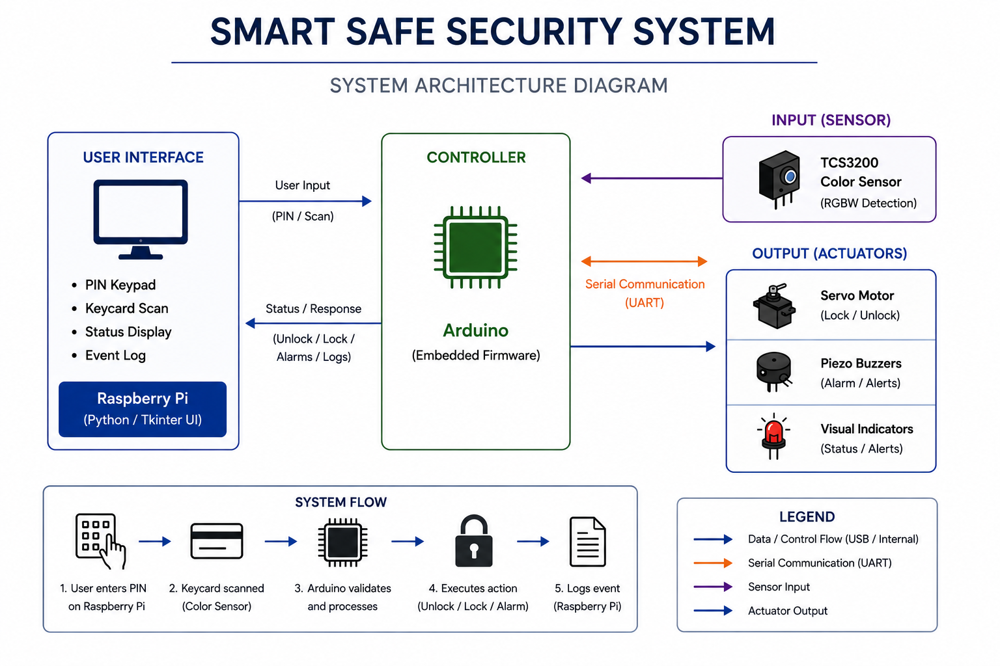
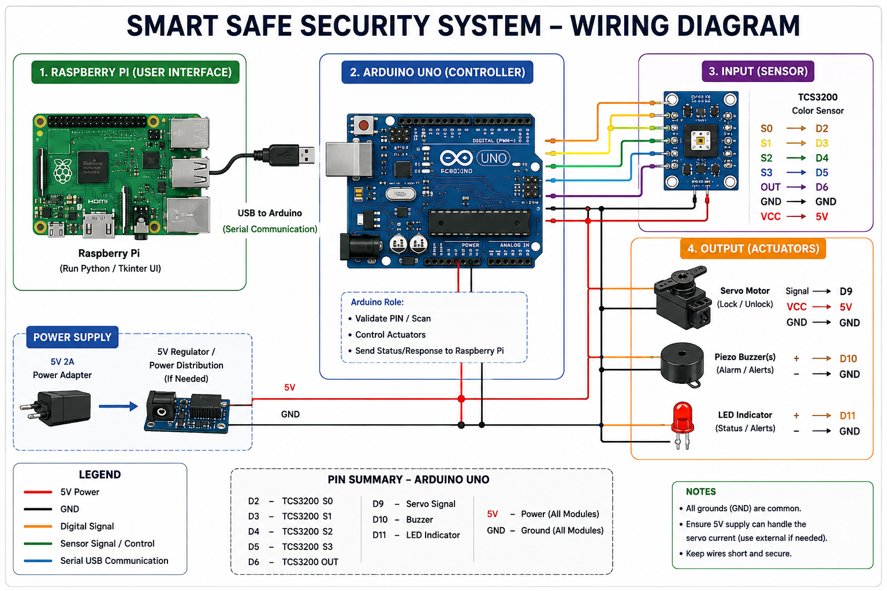
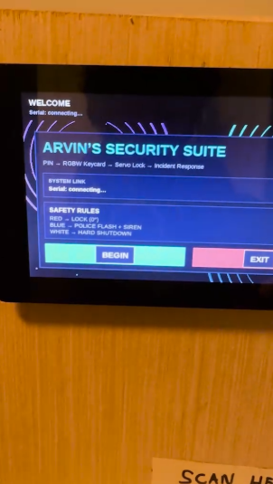

<div align="center">

# Smart Safe Security System

An embedded security system built using Arduino, Raspberry Pi, and Python that combines hardware-software integration, sensor-based authentication, real-time serial communication, and automated lock control into a fully interactive smart safe platform.

[](raspberry-pi/main.py)
[](arduino/smart_safe_arduino.ino)
[](raspberry-pi/main.py)
[](cad/3D Rack Gear Slider.zip)
</div>

---

# Demo Video

<div align="center">

[](https://youtu.be/MBJlZZYcRKk)

</div>

---

# Overview

The Smart Safe Security System was developed as an embedded systems and engineering design project focused on integrating software, electronics, and mechanical components into a unified security platform.

The system uses a Raspberry Pi running a custom Python Tkinter interface alongside an Arduino-based controller responsible for sensor processing, actuator control, and real-time hardware interaction.

The project simulates a multi-stage authentication and incident-response system using:
- PIN authentication
- RGBW keycard verification
- Real-time serial communication
- Servo-based locking
- Alarm and siren response systems
- Event logging and fail-safe protection behavior

---

# Features

- Custom Python Tkinter graphical interface
- PIN authentication with lockout protection
- RGBW keycard verification using the TCS3200 color sensor
- Real-time serial communication between Raspberry Pi and Arduino
- Servo-actuated locking mechanism
- Piezo buzzer alarm and siren system
- Event logging and monitoring
- Multithreaded scan handling
- UNKNOWN detection and fail-safe security behavior
- Embedded command-response firmware architecture
- Integrated hardware and software security workflow

---

# Technologies Used

## Software
- Python
- Tkinter
- PySerial
- Arduino C++

## Hardware
- Raspberry Pi
- Arduino Uno
- TCS3200 Color Sensor
- Servo Motor
- Piezo Buzzers
- LEDs
- External 5V Power Supply

---

# System Architecture

<div align="center">



</div>

---

# Wiring Diagram

<div align="center">



</div>

---

# User Interface

<div align="center">



</div>

---

# Authentication Workflow

```text
1. User enters PIN through Raspberry Pi interface
        ↓
2. System validates authentication credentials
        ↓
3. RGBW keycard scan is initiated
        ↓
4. Arduino processes sensor data
        ↓
5. System executes automated security response

GREEN   → Unlock
RED     → Lock
BLUE    → Alarm / Siren
WHITE   → Emergency Shutdown
UNKNOWN → Fail-safe Protection

        ↓
6. Events are logged and displayed in real time
```

---

# Embedded Systems Concepts

This project incorporates several embedded systems and software engineering concepts, including:

- Real-time hardware communication
- Sensor filtering and classification
- Event-driven programming
- Multithreaded software execution
- Hardware-software integration
- Security state management
- Command-response firmware architecture
- Fail-safe detection systems
- Embedded UI design
- Hardware actuator control

---

# Mechanical Integration

Custom 3D-printed components were designed and integrated into the system to support:
- Hardware mounting
- Internal component organization
- Servo-driven locking mechanisms
- Structural support for embedded hardware

---

# Future Improvements

- RFID / NFC authentication
- Mobile application integration
- Cloud-based event logging
- Camera monitoring system
- Remote access support
- Battery backup system
- Database-backed authentication

---

# License

This project is licensed under the MIT License.
